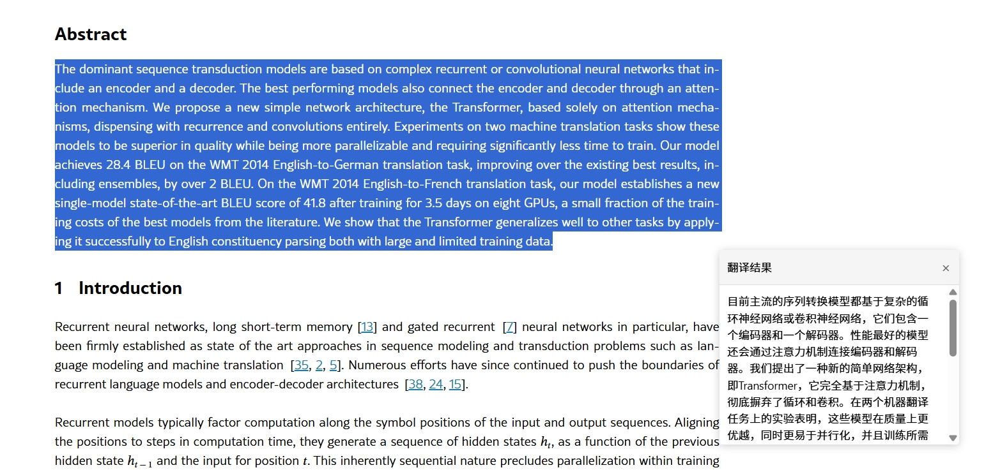
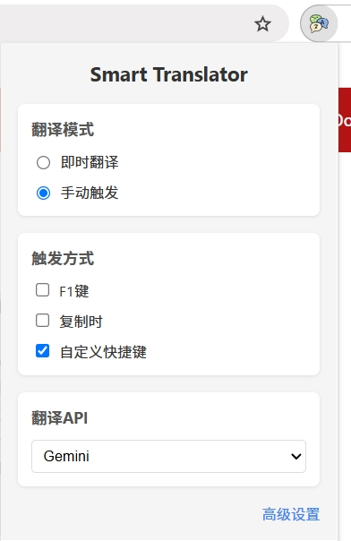
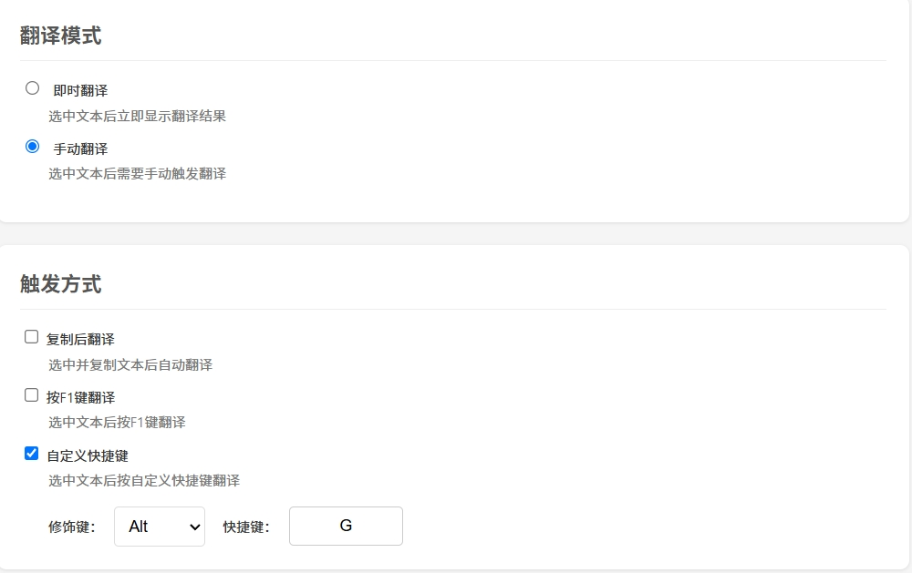

# 智能翻译助手 (Smart Translator)

一款适用于Chrome等浏览器的划词翻译插件，为您提供即时、准确的多语言翻译体验。

## 🌟 主要功能

- **智能划词翻译**
  - 即时翻译：选中文本立即显示翻译结果
  - 优雅展示：翻译结果以悬浮窗口形式展现
  

- **多样化触发方式**
  - 划词即译
  - 复制触发
  - F1快捷键触发
  - 自定义快捷键(可以在高级设置里面设置)

- **丰富的翻译API支持**
  - 免费API
    - Google翻译(无需申请API密钥)
    - Bing翻译
    - DeepL翻译
  - AI翻译支持
    - OpenAI (GPT)
    - DeepSeek
    - Gemini
  - 自定义API接入

## 📖 使用方法

### 1. 划词翻译
选中任意文本，翻译结果将自动显示在悬浮窗口中

### 2. 快捷键翻译
- 默认快捷键：选中文本后按 F1 键
- 自定义快捷键：在设置中可自定义组合键

### 3. 鼠标右键
可以使用鼠标右键进行翻译，此功能可以用于**翻译PDF文件**

### 4. 设置选项
- 点击浏览器工具栏的插件图标
- 在弹出菜单中可快速切换翻译模式
- 点击设置图标进入详细设置页面

## 🔧 安装方法

### 方法一：Chrome 应用商店安装（推荐）
1. 访问 Chrome 网上应用店
2. 搜索"智能翻译助手"
3. 点击"添加到 Chrome"即可

### 方法二：开发者模式安装
1. 下载本项目的最新发布版本
2. 打开 Chrome 浏览器，进入扩展程序页面 (chrome://extensions/)
3. 开启右上角的"开发者模式"
4. 点击"加载已解压的扩展程序"
5. 选择解压后的项目文件夹

## 🚀 未来版本

- 支持多语言切换
- 支持pdf划词翻译

## 📝 版本历史
- v1.0.0: 初始版本发布
  - 基础翻译功能
  - 多API支持
  - 设置界面